### High Level Architecture (Production)

```mermaid
flowchart TD

%% ================================
%% External Zone
%% ================================
subgraph ExternalZone["🌍 External Zone"]
    EndUsers[🧑‍💻 End Users]
    BankIndonesia[🏛️ Bank Indonesia<br/>API Key Access]
    OJK[⚖️ OJK Financial Authority<br/>API Key Access]

    subgraph EWallet["💳 E-Wallet Services"]
        GopayExternal[GoPay API]
        ShopeeExternal[ShopeePay API]
    end
end

%% ================================
%% Edge Layer
%% ================================
subgraph Edge["☁️ Edge Layer"]
    CloudFlare[CloudFlare CDN<br/>DDoS Protection]
    DNS[DNS Management<br/>skynux.fun]
end

%% ================================
%% OpenShift Platform
%% ================================
subgraph OpenShift["🏗️ OpenShift Platform (GCP Southeast Asia)"]
    direction TB

    subgraph ControlPlane["🎛️ Control Plane (3 Masters)"]
        Master1[Master Node 1]
        Master2[Master Node 2]
        Master3[Master Node 3]
    end

    subgraph Workers["💼 Worker Nodes"]
        Worker1[Worker Node 1]
        Worker2[Worker Node 2]
        Worker3[Worker Node 3]
    end

    subgraph Ingress["🔀 Ingress Layer"]
        Router[OpenShift Router<br/>HAProxy]
        Kong[Kong API Gateway<br/>Rate Limit, Auth]
    end

    subgraph Frontend["🌐 Frontend"]
        WebApp[Web Application]
    end

    subgraph Microservices["🔧 Microservices"]
        AuthService[Authentication Service]
        PaymentService[Payment Service]
        TransactionService[Transaction Service]
    end

    subgraph DataLayer["🗄️ Data & Storage"]
        Postgres[PostgreSQL Cluster]
        Redis[Redis Cluster]
        Kafka[Kafka Cluster]
    end

    subgraph Observability["📊 Observability Stack"]
        Otel[OpenTelemetry Collector]
        Prometheus[Prometheus]
        Grafana[Grafana]
        Loki[Loki]
        Tempo[Tempo]
    end

    subgraph DevOps["🔧 DevOps Tools"]
        Jenkins[Jenkins CI/CD]
        SonarQube[SonarQube]
        KafkaUI[Kafka UI]
    end
end

%% ================================
%% Connections
%% ================================

%% End user path
EndUsers --> WebApp
WebApp --> CloudFlare
CloudFlare --> DNS --> Router --> Kong

%% Bank Indonesia and OJK APIs
BankIndonesia --> CloudFlare
OJK --> CloudFlare

%% Routing to microservices
Kong --> AuthService
Kong --> PaymentService
Kong --> TransactionService

%% Microservices data access
AuthService --> Postgres
PaymentService --> Postgres
PaymentService --> Redis
PaymentService --> Kafka
TransactionService --> Postgres
TransactionService --> Redis
TransactionService --> Kafka

%% External service integration
PaymentService --> GopayExternal
PaymentService --> ShopeeExternal

%% Observability
AuthService -.-> Otel
PaymentService -.-> Otel
TransactionService -.-> Otel
Otel --> Prometheus --> Grafana
Otel --> Loki --> Grafana
Otel --> Tempo --> Grafana

%% DevOps tools
Jenkins -.-> SonarQube
Kafka -.-> KafkaUI
```

### High Level Architecture (Development)

```mermaid
flowchart TD

%% ================================
%% 🌍 External Zone
%% ================================
subgraph ExternalZone["🌍 External Zone"]
    EndUsers[🧑‍💻 End Users]
    BankIndonesia[🏛️ Bank Indonesia<br/>API Key Access]
    OJK[⚖️ OJK Financial Authority<br/>API Key Access]

    subgraph EWallet["💳 External E-Wallet Services"]
        GopayExternal[GoPay API<br/>api.gopay.com]
        ShopeeExternal[ShopeePay API<br/>api.shopeepay.com]
    end
end

%% ================================
%% 🌐 DNS Layer (Direct)
%% ================================
subgraph DNSLayer["🌐 DNS Layer"]
    DNS[DNS Management<br/>skynux.fun<br/>Direct Resolution]
end

%% ================================
%% 🏗️ OpenShift - Single Node
%% ================================
subgraph OpenShift["🏗️ OpenShift Platform (Single Node - GCP SEA)"]
    direction TB

    subgraph AllInOne["🎯 All-in-One Node"]
        SingleNode[Master + Worker<br/>Control Plane + App Pods]
    end

    subgraph Ingress["🔀 Ingress & Gateway"]
        Router[OpenShift Router<br/>HAProxy]
        Kong[Kong API Gateway<br/>Rate Limit, Auth]
    end

    subgraph Frontend["🌐 Frontend Layer"]
        WebApp[Web Application]
    end

    subgraph Microservices["🔧 Microservices"]
        AuthService[Authentication Service]
        PaymentService[Payment Service]
        TransactionService[Transaction Service]
    end

    subgraph Data["🗄️ Data & Storage"]
        Postgres[PostgreSQL<br/>Single Instance]
        Redis[Redis<br/>Single Instance]
        Kafka[Kafka<br/>Single Instance]
    end

    subgraph Observability["📊 Observability"]
        Otel[OpenTelemetry Collector]
        Prometheus[Prometheus]
        Grafana[Grafana]
        Loki[Loki]
        Tempo[Tempo]
    end

    subgraph DevOps["🔧 DevOps Tools"]
        Jenkins[Jenkins CI/CD]
        SonarQube[SonarQube]
        KafkaUI[Kafka UI]
    end
end

%% ================================
%% 🔗 Connections
%% ================================

%% External access to frontend
EndUsers --> WebApp
WebApp --> DNS
BankIndonesia --> DNS
OJK --> DNS
DNS --> Router --> Kong

%% Kong routes to microservices
Kong --> AuthService
Kong --> PaymentService
Kong --> TransactionService

%% Microservices to data
AuthService --> Postgres
PaymentService --> Postgres
PaymentService --> Redis
PaymentService --> Kafka
TransactionService --> Postgres
TransactionService --> Redis
TransactionService --> Kafka

%% External API calls
PaymentService --> GopayExternal
PaymentService --> ShopeeExternal

%% Observability
AuthService -.-> Otel
PaymentService -.-> Otel
TransactionService -.-> Otel
Otel --> Prometheus --> Grafana
Otel --> Loki --> Grafana
Otel --> Tempo --> Grafana

%% DevOps Tools
Jenkins -.-> SonarQube
Kafka -.-> KafkaUI
```

### ERD

### Network Architecture & Security

```mermaid
graph TB
subgraph "GCP Project: fp-secure-api-gateway"
subgraph "VPC: ocp-one-gate-payment-network"
subgraph "Control Plane Subnet: 10.0.0.0/19"
Master1[🎛️ Master Node 1<br/>API Server, etcd, Controller]
Master2[🎛️ Master Node 2<br/>API Server, etcd, Controller]
Master3[🎛️ Master Node 3<br/>API Server, etcd, Controller]
end

subgraph "Worker Subnet: 10.0.32.0/19"
Worker1[💼 Worker Node 1<br/>Application Pods]
Worker2[💼 Worker Node 2<br/>Application Pods]
Worker3[💼 Worker Node 3<br/>Application Pods]
end

subgraph "Load Balancers"
ExtLB[🌐 External LB<br/>API: 6443]
IntLB[🔒 Internal LB<br/>API Internal: 6443]
end

subgraph "Network Services"
CloudRouter[🔀 Cloud Router<br/>NAT Gateway]
CloudNAT[🌐 Cloud NAT<br/>Outbound Internet]
end
end
end

subgraph "Security Zones"
Firewall[🔥 Firewall Rules<br/>- Internal: All protocols<br/>- SSH: Port 22<br/>- API: Port 6443<br/>- HTTP/S: 80,443]
end

Internet[🌍 Internet] --> ExtLB
ExtLB --> Master1
ExtLB --> Master2
ExtLB --> Master3
IntLB --> Master1
IntLB --> Master2
IntLB --> Master3

Master1 --> Worker1
Master2 --> Worker2
Master3 --> Worker3

Worker1 --> CloudRouter
Worker2 --> CloudRouter
Worker3 --> CloudRouter
CloudRouter --> CloudNAT
CloudNAT --> Internet
```

### Database Architecture & Data Flow

### External Service Architecture

```mermaid
graph TB
    subgraph "One Gate Payment Platform"
        PaymentService[💰 Payment Service<br/>Core Business Logic]
        ExtServiceLayer[🔌 External Service Layer<br/>Adapters & Clients]
    end
    
    subgraph "API Security & Rate Limiting"
        APIGateway[🦍 Kong Gateway<br/>- Authentication<br/>- Rate Limiting<br/>- Request/Response Transform]
    end
    
    subgraph "External E-Wallet Providers"
        subgraph "GoPay Integration"
            GopayAuth[🔐 GoPay OAuth2<br/>client_credentials]
            GopayAPI[💳 GoPay API<br/>- Balance Check<br/>- Top Up Requests]
        end
        
        subgraph "ShopeePay Integration"
            ShopeeAuth[🔐 ShopeePay JWT<br/>Signature + Timestamp]
            ShopeeAPI[🛒 ShopeePay API<br/>- Account Balance<br/>- Wallet Top Up]
        end
        

    end
    
    subgraph "Government API Access (Inbound)"
        BankIndonesia[🏛️ Bank Indonesia<br/>Transaction Monitoring<br/>API Key: a1b2c3d4...<br/>READ_TRANSACTIONS]
        OJK[⚖️ OJK Financial Authority<br/>Compliance Reporting<br/>API Key: f9e8d7c6...<br/>READ_TRANSACTIONS,READ_REPORTS]
    end
    
    subgraph "API Rate Limits & Security"
        subgraph "Consumer: bank-indonesia"
            BiLimits[📊 Rate Limits<br/>- 100/minute<br/>- 1000/hour<br/>- 10000/day]
        end
        
        subgraph "Consumer: ojk"
            OjkLimits[📊 Rate Limits<br/>- 200/minute<br/>- 2000/hour<br/>- 20000/day]
        end
    end
    
    PaymentService --> ExtServiceLayer
    ExtServiceLayer --> APIGateway
    
    ExtServiceLayer --> GopayAuth
    GopayAuth --> GopayAPI
    
    ExtServiceLayer --> ShopeeAuth
    ShopeeAuth --> ShopeeAPI
    
    %% Government agencies access via API Gateway (inbound)
    BankIndonesia --> APIGateway
    OJK --> APIGateway
    APIGateway --> TransactionService
    
    BankIndonesia -.-> BiLimits
    OJK -.-> OjkLimits
```

### DevOps CI/CD Pipeline

```mermaid
graph LR
    subgraph "Source Control"
        Git[📚 Git Repository<br/>Source Code]
        Webhook[🔔 Git Webhook<br/>Push Events]
    end
    
    subgraph "CI/CD Pipeline - Jenkins"
        subgraph "Build Stage"
            Checkout[📥 Checkout Code]
            Test[🧪 Unit Tests<br/>Integration Tests]
            SonarScan[🔍 SonarQube Scan<br/>Code Quality]
        end
        
        subgraph "Build & Package"
            DockerBuild[🐳 Docker Build<br/>Multi-stage Build]
            ImageScan[🔒 Security Scan<br/>Vulnerability Check]
            Registry[📦 Image Registry<br/>Harbor/Quay]
        end
        
        subgraph "Deploy Stage"
            Deploy[🚀 Deploy to OpenShift<br/>Rolling Update]
            Verify[✅ Health Check<br/>Smoke Tests]
        end
    end
    
    subgraph "Environment Progression"
        Dev[🧪 Development<br/>one-gate-payment NS]
        Staging[🎭 Staging<br/>staging NS]
        Prod[🎯 Production<br/>production NS]
    end
    
    subgraph "Monitoring & Alerts"
        Monitor[📊 Prometheus Alerts<br/>Deployment Status]
        Notify[📧 Notifications<br/>Slack/Email]
    end
    
    Git --> Webhook
    Webhook --> Checkout
    Checkout --> Test
    Test --> SonarScan
    SonarScan --> DockerBuild
    DockerBuild --> ImageScan
    ImageScan --> Registry
    Registry --> Deploy
    Deploy --> Verify
    
    Deploy --> Dev
    Dev --> Staging
    Staging --> Prod
    
    Verify --> Monitor
    Monitor --> Notify
```

### Security Architecture

```mermaid
graph TB
    subgraph "External Security"
        CloudFlare[☁️ CloudFlare<br/>- DDoS Protection<br/>- WAF Rules<br/>- SSL/TLS Termination]
        DNS[🌐 DNS Security<br/>- DNSSEC<br/>- DNS Filtering]
    end
    
    subgraph "Network Security"
        subgraph "OpenShift Security"
            RBAC[🔐 RBAC<br/>Role-Based Access]
            SCC[🛡️ Security Context Constraints<br/>Pod Security]
            NetworkPolicy[🔒 Network Policies<br/>Pod-to-Pod Communication]
            Secrets[🔑 OpenShift Secrets<br/>Encrypted at Rest]
        end
        
        subgraph "API Gateway Security"
            KongAuth[🦍 Kong Authentication<br/>- JWT Validation<br/>- API Key Management<br/>- Rate Limiting]
            CORS[🌐 CORS Policy<br/>Cross-Origin Protection]
            RequestTransform[🔄 Request Transform<br/>Header Sanitization]
        end
    end
    
    subgraph "Application Security"
        subgraph "Authentication Layer"
            JWT[🎫 JWT Tokens<br/>- Access Token 15min<br/>- Refresh Token 7 days]
            PassHash[🔒 Password Hashing<br/>Argon2ID]
            SessionMgmt[🗂️ Session Management<br/>Redis Store]
        end
        
        subgraph "Data Security"
            Encryption[🔐 Database Encryption<br/>- Data at Rest<br/>- Connection Encryption]
            PII[🛡️ PII Protection<br/>- Data Masking<br/>- Access Logging]
            Backup[💾 Secure Backups<br/>Encrypted Storage]
        end
    end
    
    subgraph "Compliance & Auditing"
        APILogs[📋 API Access Logs<br/>- IP Tracking<br/>- Request/Response<br/>- Rate Limit Events]
        AuditTrail[📊 Audit Trail<br/>- User Actions<br/>- Data Changes<br/>- System Events]
        Compliance[⚖️ Regulatory Compliance<br/>- Bank Indonesia<br/>- OJK Requirements]
    end
    
    CloudFlare --> DNS
    DNS --> RBAC
    RBAC --> SCC
    SCC --> NetworkPolicy
    NetworkPolicy --> KongAuth
    KongAuth --> CORS
    CORS --> RequestTransform
    RequestTransform --> JWT
    JWT --> PassHash
    PassHash --> SessionMgmt
    SessionMgmt --> Encryption
    Encryption --> PII
    PII --> Backup
    Backup --> APILogs
    APILogs --> AuditTrail
    AuditTrail --> Compliance
```

### Deployment & Scaling Strategy

```mermaid
graph TB
    subgraph "Horizontal Pod Autoscaler (HPA)"
        HPAAuth[📈 Auth Service HPA<br/>CPU: 70% threshold<br/>Min: 2, Max: 10 pods]
        HPAPayment[📈 Payment Service HPA<br/>CPU: 70% threshold<br/>Min: 3, Max: 15 pods]
        HPATransaction[📈 Transaction Service HPA<br/>CPU: 70% threshold<br/>Min: 2, Max: 8 pods]
    end
    
    subgraph "Resource Management"
        subgraph "Authentication Service"
            AuthPods[🔐 Auth Pods<br/>Requests: 200m CPU, 256Mi<br/>Limits: 500m CPU, 512Mi]
        end
        
        subgraph "Payment Service"  
            PaymentPods[💰 Payment Pods<br/>Requests: 300m CPU, 512Mi<br/>Limits: 1000m CPU, 1Gi]
        end
        
        subgraph "Transaction Service"
            TransactionPods[📊 Transaction Pods<br/>Requests: 200m CPU, 256Mi<br/>Limits: 500m CPU, 512Mi]
        end
    end
    
    subgraph "Database Scaling"
        PostgresHA[🐘 PostgreSQL<br/>Single Instance<br/>Memory: 2Gi, CPU: 1000m<br/>Storage: 20Gi]
        RedisCluster[⚡ Redis Cluster<br/>Memory: 512Mi<br/>Maxmemory Policy: allkeys-lru]
        KafkaPartitions[📨 Kafka Scaling<br/>Partitions: 3 per topic<br/>Replication: 1<br/>Storage: 20Gi]
    end
    
    subgraph "Load Balancing"
        ServiceMesh[🕸️ Service Discovery<br/>OpenShift Services<br/>Round-robin Load Balancing]
        Ingress[🚪 Ingress Controllers<br/>HAProxy Router<br/>SSL Termination]
    end
    
    HPAAuth --> AuthPods
    HPAPayment --> PaymentPods
    HPATransaction --> TransactionPods
    
    AuthPods --> ServiceMesh
    PaymentPods --> ServiceMesh
    TransactionPods --> ServiceMesh
    
    ServiceMesh --> Ingress
    
    AuthPods -.-> RedisCluster
    PaymentPods -.-> PostgresHA
    PaymentPods -.-> RedisCluster
    PaymentPods -.-> KafkaPartitions
    TransactionPods -.-> PostgresHA
    TransactionPods -.-> KafkaPartitions
```

### Monitoring & Observability Stack

```mermaid
graph TB
    subgraph "Application Instrumentation"
        AuthMetrics[🔐 Auth Service<br/>OpenTelemetry SDK]
        PaymentMetrics[💰 Payment Service<br/>OpenTelemetry SDK]
        TransactionMetrics[📊 Transaction Service<br/>OpenTelemetry SDK]
    end
    
    subgraph "OpenTelemetry Collector"
        OtelReceiver[📡 OTLP Receiver<br/>gRPC: 4317, HTTP: 4318]
        OtelProcessor[⚙️ Batch Processor<br/>- Batch Size: 100<br/>- Timeout: 10s]
        OtelExporter[📤 Exporters<br/>- Prometheus<br/>- Loki<br/>- Tempo]
    end
    
    subgraph "Observability Backends"
        subgraph "Metrics"
            Prometheus[📊 Prometheus<br/>- Metrics Storage<br/>- Alerting Rules<br/>- Remote Write: Enabled]
            Grafana[📈 Grafana Dashboards<br/>- System Metrics<br/>- Business KPIs<br/>- Alerts Visualization]
        end
        
        subgraph "Logging"
            Loki[📝 Loki<br/>- Log Aggregation<br/>- Label-based Indexing<br/>- Log Retention: 168h]
            LogDashboard[📋 Log Dashboard<br/>- Error Tracking<br/>- Performance Logs<br/>- Audit Trails]
        end
        
        subgraph "Tracing"
            Tempo[🔍 Tempo<br/>- Distributed Tracing<br/>- Trace Storage<br/>- Service Dependencies]
            TraceDashboard[🗺️ Trace Dashboard<br/>- Request Flow<br/>- Latency Analysis<br/>- Error Attribution]
        end
    end
    
    subgraph "Alert Management"
        AlertManager[🚨 AlertManager<br/>- Alert Routing<br/>- Notification Channels<br/>- Alert Grouping]
        Notifications[📧 Notifications<br/>- Slack<br/>- Email<br/>- PagerDuty]
    end
    
    AuthMetrics --> OtelReceiver
    PaymentMetrics --> OtelReceiver
    TransactionMetrics --> OtelReceiver
    
    OtelReceiver --> OtelProcessor
    OtelProcessor --> OtelExporter
    
    OtelExporter --> Prometheus
    OtelExporter --> Loki
    OtelExporter --> Tempo
    
    Prometheus --> Grafana
    Prometheus --> AlertManager
    Loki --> LogDashboard
    Tempo --> TraceDashboard
    
    AlertManager --> Notifications
    Grafana --> Notifications
```
